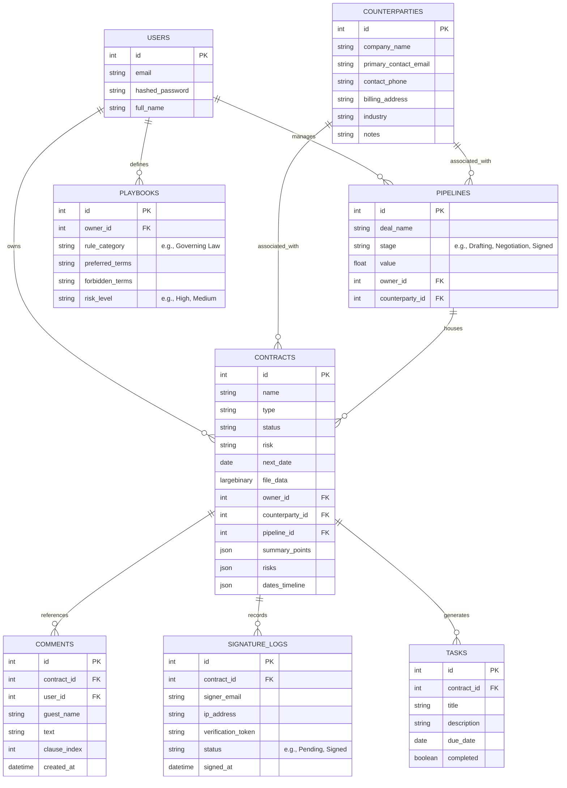

# Product Audit & Feature Recommendation Plan: AI Contract CRM (VelFlow)

This document contains a comprehensive audit of the current **AI Contract Navigator** implementation and details a prioritized list of new features, functionalities, and architectural enhancements required to elevate the platform from a contract analyzer into an interactive, premium **Contract CRM / Contract Lifecycle Management (CLM)** SaaS MVP.

---

## 1. Project Audit: Current Implementation

The current codebase is a highly polished, fully functional local prototype of an **AI-powered Contract Analyzer**. It successfully handles post-upload contract analysis, risks profiling, and basic document version comparisons. 

### Core Strengths of Current Code
*   **Intuitive Presentation**: The Landing Page ([frontend/app/page.tsx](file:///Users/nitindeepsingh/Developer/velflow.dev/frontend/app/page.tsx)) and Dashboard ([frontend/app/dashboard/page.tsx](file:///Users/nitindeepsingh/Developer/velflow.dev/frontend/app/dashboard/page.tsx)) have beautiful dark-themed sidebars, modern light-themed tables, status indicators, and clean layout animations.
*   **Interactive Visualizations**: Custom SVG-based elements like the Risk Radar ([frontend/components/contract/risk-radar.tsx](file:///Users/nitindeepsingh/Developer/velflow.dev/frontend/components/contract/risk-radar.tsx)) and the Milestones Timeline ([frontend/components/contract/dates-scheduler.tsx](file:///Users/nitindeepsingh/Developer/velflow.dev/frontend/components/contract/dates-scheduler.tsx)) provide premium, visual ways of interacting with extracted data.
*   **Structured AI Pipeline**: The backend ([backend/app/routers/contracts.py](file:///Users/nitindeepsingh/Developer/velflow.dev/backend/app/routers/contracts.py)) extracts text from PDF and DOCX documents and classifies counterparties, summary points, risk levels, and milestones using FastAPI and LLM completions.
*   **Semantic Q&A**: Users can chat directly with their contracts via an integrated RAG (Retrieval-Augmented Generation) chat widget ([frontend/components/contract/qa-navigator.tsx](file:///Users/nitindeepsingh/Developer/velflow.dev/frontend/components/contract/qa-navigator.tsx)).
*   **Version Compare**: Offers side-by-side comparison ([frontend/components/contract/compare-viewer.tsx](file:///Users/nitindeepsingh/Developer/velflow.dev/frontend/components/contract/compare-viewer.tsx)) of two contract versions to identify changes at the clause level.

### Current Limitations (Gap Analysis for a CRM/CLM)
*   **Unidirectional Workflow (Passive Viewer)**: The application is currently passive. A user uploads a signed or static contract, and the app reads it. In a true CLM/CRM, the workflow is bidirectional: users draft contracts, negotiate clauses, send them out for signature, sign them online, and then track execution and renewals.
*   **Lack of Deal Pipeline Tracking**: There is no concept of a "sales deal" or "pipeline stage" linking a contract to a customer relationship status.
*   **Single-Sided System**: There is no secure way for outside parties (counterparties/clients) to review, collaborate, or sign contracts within the platform.
*   **No Active Editing or Playbooks**: Users cannot edit clauses directly in the browser or verify draft clauses against a predefined "corporate playbook" (e.g., standard liability limits).

---

## 2. Recommended Features for MVP Expansion

To transition VelFlow into a robust Contract CRM, features must span the entire **Contract Lifecycle** (Drafting, Negotiation, Execution, Post-Execution, Relationship Tracking). Below is the recommended list of new features categorized by lifecycle stages.

### Category A: Pipeline & Relationship Management (CRM Core)

#### 1. Kanban Deal-to-Contract Pipeline
*   **What It Is**: A visual Kanban board (similar to Trello or HubSpot) where contracts are represented as cards and moved through status columns: `Drafting` ➔ `Internal Review` ➔ `In Negotiation` ➔ `Out for Signature` ➔ `Signed` ➔ `Active` ➔ `Archived`.
*   **Value Proposition**: Connects the contract directly to the deal velocity, allowing founders and sales teams to see exactly where deals are stalling in legal negotiations.
*   **Implementation**: Create a `pipelines` table in the database and a drag-and-drop React board on the dashboard frontend.

#### 2. 360-Degree Counterparty Directory
*   **What It Is**: A dedicated CRM directory of all counterparties (Clients, Vendors, Partners, Freelancers). Clicking a contact displays:
    *   Active, pending, and historically signed contracts with that counterparty.
    *   Total Contract Value (TCV) and Annual Contract Value (ACV) summary.
    *   Aggregated risk profile (e.g., "This client historically insists on high liability caps").
    *   Activity feed (email threads, comments, versions).
*   **Value Proposition**: Builds institutional knowledge about negotiating history with specific clients.
*   **Implementation**: Create a new `counterparties` model linking multiple contracts to a single organization or individual profile.

---

### Category B: Smart Drafting & Playbooks (Drafting Phase)

#### 3. AI-Powered Smart Clause Wizard (Drafting Generator)
*   **What It Is**: A no-code generator that constructs common agreements (NDAs, SaaS Service Agreements, Consulting Contracts) using customizable templates. The AI guides the user with dynamic prompts (e.g., "Specify your payment terms," "State intellectual property rights") and automatically injects standard pre-approved legal language.
*   **Value Proposition**: Saves small business owners the cost of generating standard contracts from scratch.
*   **Implementation**: Standardize markdown templates on the backend and build a multi-step form UI.

#### 4. Company Playbook & Clause Compliance Guard
*   **What It Is**: A feature where users define their standard preferred terms (e.g., "Governing law must be Delaware," "Maximum liability capped at 1x annual fees"). When a third-party contract is uploaded, the Risk Radar checks it against the *Company Playbook* rather than just general risks, highlighting custom playbook violations.
*   **Value Proposition**: Standardizes risk review to match unique company tolerances instead of generic AI opinions.
*   **Implementation**: Create a `playbooks` table storing key rule parameters, and include these parameters in the LLM analysis system prompt.

---

### Category C: Interactive Collaboration (Negotiation Phase)

#### 5. Live Document Redlining & Threaded Comments
*   **What It Is**: An inline document viewer where users can highlight text, add comments, and suggest modifications (redlines) directly on clauses. 
*   **Value Proposition**: Replaces messy Word/PDF revisions over email, keeping discussions tied directly to the relevant clause.
*   **Implementation**: Integrate a rich text editor (e.g., TipTap or Quill) on the frontend that tracks revisions and stores comments inline.

#### 6. Guest Negotiation Portal
*   **What It Is**: A secure, public-facing link that the user can share with external counterparties or their legal counsel. Guests can view the contract, reply to comments, suggest changes, or request edits, without needing to create a paid VelFlow account.
*   **Value Proposition**: Dramatically speeds up negotiation loops.
*   **Implementation**: Use token-based secure link generation (e.g., `https://velflow.dev/share/contract_uuid`) with granular guest write-permissions.

---

### Category D: Signing & Legal Execution (Execution Phase)

#### 7. Built-in E-Signatures (Native Signatures)
*   **What It Is**: A legally binding digital signature module allowing both parties to electronically sign the contract directly in the browser (fully compliant with the US ESIGN Act and European eIDAS regulation).
*   **Value Proposition**: Eliminates the need for third-party subscriptions like DocuSign, HelloSign, or PandaDoc.
*   **Implementation**: Capture signatures as SVG coordinates or typographic renderings, embed them into the PDF binary, and hash the file to prevent tampering.

#### 8. Cryptographic Audit Trail (Certificate of Completion)
*   **What It Is**: A generated certificate appended to signed contracts certifying the IP addresses, email verifications, dates, times, and hashes of both signing parties.
*   **Value Proposition**: Establishes high credibility and enforceability for contracts signed on the platform.
*   **Implementation**: Implement SHA-256 hashing of the contract content at the time of signing and log metadata in a secure `signature_logs` database table.

---

### Category E: Operations & Integrations (Post-Execution Phase)

#### 9. AI Obligation Tracker & Task Generator
*   **What It Is**: AI parses signed contracts to extract obligations and deliverables (e.g., "Deliver quarterly status reports by Day 15," "Invoice sent on 1st of month"). The system automatically creates interactive tasks on the dashboard calendar with due dates and email notification triggers.
*   **Value Proposition**: Ensures that users actually fulfill contract terms and don't miss critical delivery dates.
*   **Implementation**: Expand backend extraction to identify obligations and output them as a list of actionable `tasks` linked to the contract.

#### 10. Webhooks & Third-Party App Integrations (Slack, Zapier, HubSpot)
*   **What It Is**: Automated integrations that trigger when a contract moves to "Signed":
    *   **HubSpot/Salesforce**: Automatically mark the corresponding deal stage as "Closed-Won".
    *   **Slack**: Send a celebratory message to a sales channel (e.g., "Contract signed with Acma Corp! 🎉").
    *   **Stripe**: Automatically trigger billing schedules or generate subscription accounts.
*   **Value Proposition**: Fits seamlessly into existing tech stacks, positioning the product as a pipeline booster.
*   **Implementation**: Add a webhook dispatch service to the FastAPI backend and configure API integrations.

---

## 3. Recommended Database Schema Expansion

To support these features, the database schema must expand beyond the core `Contract` model ([backend/app/models/contract.py](file:///Users/nitindeepsingh/Developer/velflow.dev/backend/app/models/contract.py)). Here is the proposed database schema design:

---

## 4. Prioritized Implementation Roadmap

To maintain a fast time-to-market and build a compelling MVP, the proposed features should be released in three distinct phases:

### Phase 1: The Pipeline & Contact Hub (Week 1–2)
*Focus: Establish the "CRM" foundations and connection between deals and agreements.*
1.  Add the **Counterparties Directory** to centralize all clients.
2.  Build the **Kanban Deal-to-Contract Pipeline** dashboard to track agreement progress visually.
3.  Support linking multiple versions of a contract directly to a single Pipeline Deal.

### Phase 2: Collaboration & Execution (Week 3–4)
*Focus: Eliminate third-party negotiation and signing tools.*
1.  Implement the **Guest Portal** so client lawyers can view contracts via secure links.
2.  Integrate the **E-Signatures Module** with native signing certificate creation.
3.  Add **Threaded Comments** for inline clause negotiations.

### Phase 3: AI Intelligence Expansion (Week 5–6)
*Focus: Make the AI highly specialized and actionable.*
1.  Implement the **Company Playbook Guard** to check incoming contracts against custom rules.
2.  Enable the **AI Obligation Tracker** to automatically seed actionable calendars/checklists.
3.  Build **Slack & Zapier Webhook Integrations** for automatic signing celebrations.

---

## 5. Visual UX Recommendations to "Wow" Users
To ensure the product looks and feels premium (supporting rich aesthetics and animations):
*   **Interactive Deal Cards**: On the Kanban board, show card previews that reveal the risk score (Risk Radar color) directly, so users can see which stalled deals carry the highest liability.
*   **Glassmorphism Signature Canvas**: When signing, display an elegant modal with a frosted-glass backdrop, smooth stroke velocity interpolation, and a digital signature confirmation sound/micro-animation.
*   **Inline Risk Pill Popovers**: In the contract editor, add small hoverable risk indicators directly beside high-risk text lines, opening elegant tooltips with suggestions on how to rephrase the clause.
*   **Activity Feed Timeline**: Provide a vertical feed of all negotiations on the sidebar, showing avatars, timestamps, and version icons sliding in with smooth CSS ease-in-out transitions.
